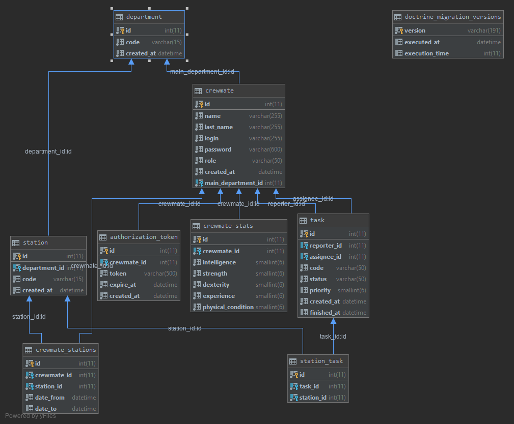

# Aplikacja symulująca załogę statku kosmicznego

## Uruchomienie

* MP1 - ```cd frontend && npm install && npm run start```

## Wykres diagramu realcji encji



## Technologie
* VUE
* PHP + Symfony

## Autor
* Maciej Kruszewski s13767